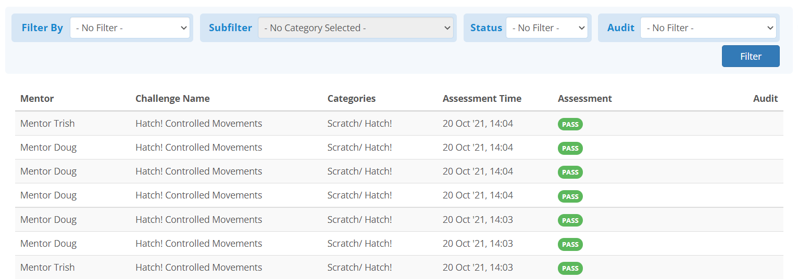
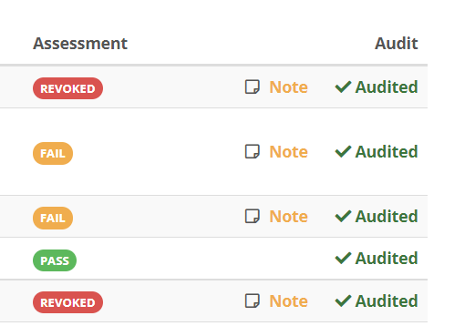

## Overview
The audit tab allows community group admins review the feedback of their
mentors, and provide feedback to the mentors if the admin so chooses. This tool
will be important for managing challenge solution checkers within your
communities and making sure they are giving good and accurate feedback.

## The Feedback List
When entering the audit tab, you will be shown a table that looks similar to
this, but with mentors within your own communities:

{:.center}

The assessment labels are the same as would appear in the
**My Checking History** tab, but in this page you can see *All mentors but*
*your own's feedback*.

The audit section may also include labels for whether any given solution was
audited or not, and if a note was attached:

{:.center}
