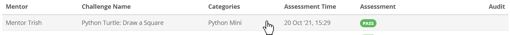
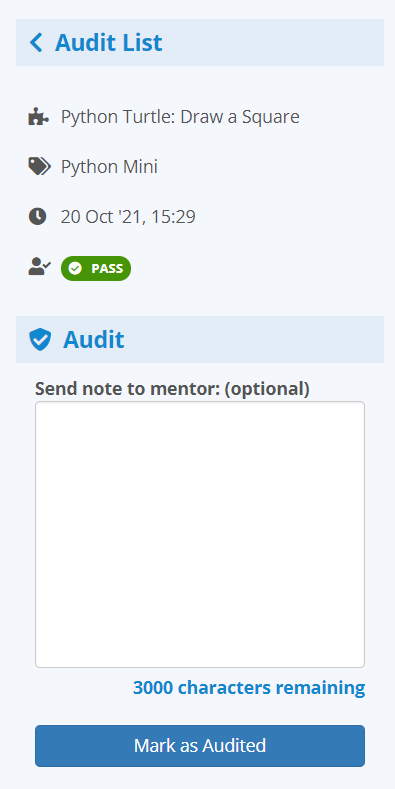
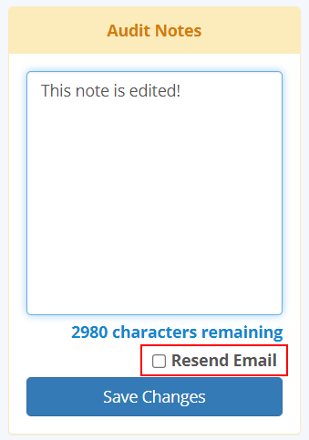
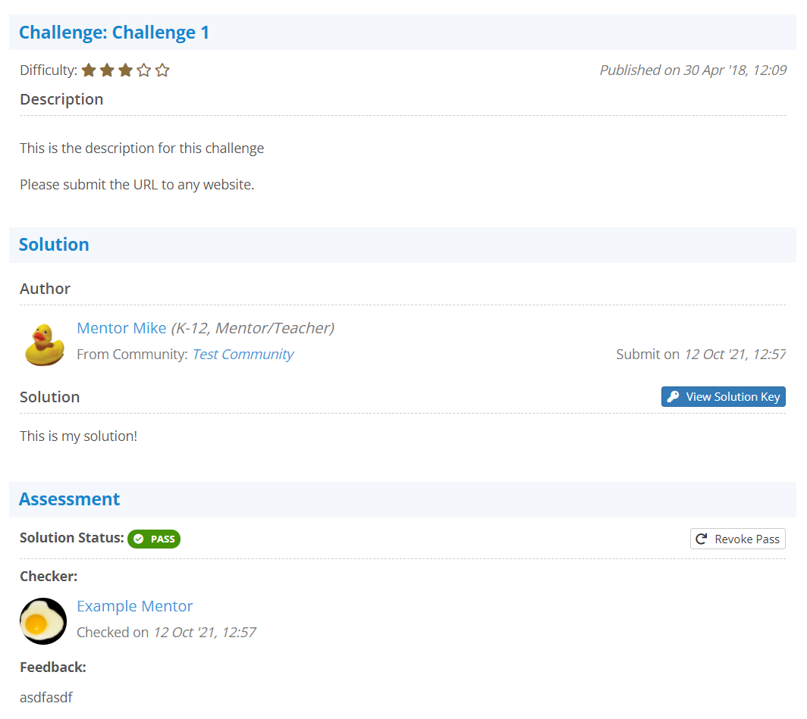

## Accessing a Solution
You may access a particular solution from your history by simply clicking on
it:

{:.center}

## The Left Side Panel
When you are inside a solution, you will have a left side panel that gives some
quick information about the solution you are looking at:

{:.center}

As a community group admin, you may choose to mark this solution as audited by
simply clicking on the **Mark as Audited** button. However, if you choose to
leave a note with the audit, then two things will happen:

1. The mentor being audited will receive an email notifying them one of their
feedbacks have been audited with a note
2. Other community group admins and the mentor being audited will be able to
see the note.

**This is not meant to be a personal notetaking system, nor a private**
**messaging system. It is meant to be a way to communicate good solution**
**checking methods to your mentors.** Any community group admin may audit any
feedback that is not their own, and every admin may edit the audit notes left
by any other community group admin (with the additional option to resend an
additional email if the change is significant enough to warrant notifying the
mentor in question a second time)

{:.center}

## The Audit Solution Feedback View
Visually, the audit solution feedback view looks just like you were checking
the solution, or reviewing one of your own feedback histories:

{:.center}

The only difference between this view and viewing one of your own feedbacks is
that the mentor is somebody else. **Note that you are still able to revoke**
**a pass from a solution you have not checked yourself.** This function is
useful if a mentor passed a solution they shouldn't have, and the solution the
student submitted is far enough off the mark to warrant a retry.

If you are revoking a solution's pass, this would most likely warrant leaving
an audit note to the mentor who originally passed the solution so they don't
make the same mistake twice.
