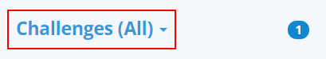
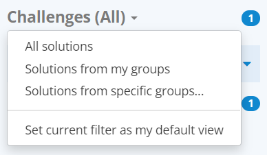
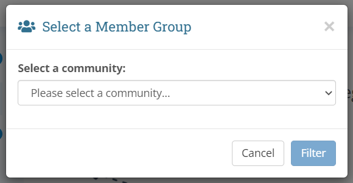
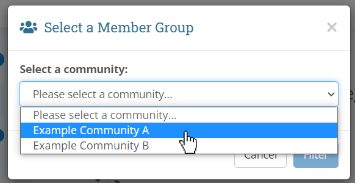
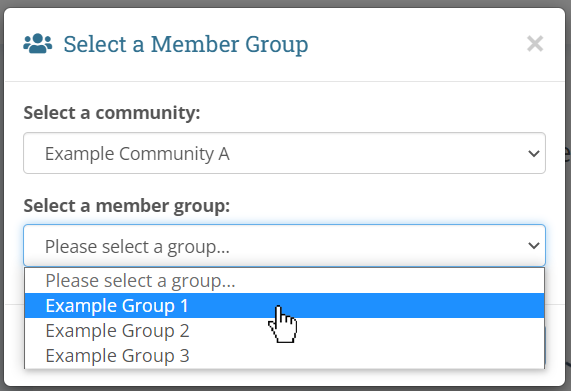
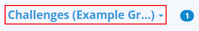

In this section, we will expand upon the filtering options available to you in
the left side panel.

## Choosing a Filter
When checking challenge solutions, it may often be the case that you only wish
to see a particular group of students' submissions rather than everyone's. You
may accomplish this by filtering by your **community defined member groups**.

To choose a filter, click on the **Challenges (All)** label at the top of the
left side panel:

{:.center}

After Clicking:

{:.center}

In this dropdown, you have three options:

1. **All solutions**: This is the default view. You can tell you are currently
in this view by seeing if the label to the right of the word **Challenges**
reads **(All)**.

2. **Solutions from my groups**: This view will only show submissions from
community members that exist in *any of your community defined member groups*.
Please note that these groups are defined by each individual teacher, which
means this view will be different from teacher to teacher. You can tell you are
currently in this view by seeing if the label to the right of the word
**Challenges** reads **(My Groups)**.

3. **Solutions from specific groups...**: This will open a popup which will ask
you which community you wish to select a group from, then which group you wish
to see submissions from. This view may be useful in the case of wanting to only
check one specific classroom of students' submissions. You can tell you are
currently in this view by seeing if the label to the right of the word
**Challenges** contains your group's name, for example, **(ClassroomA)**.

## Solutions from Specific Groups
To expand on the previous section, the specific group popup looks like this
initially:

{:.center}

You will see that there is only one dropdown for choosing a community, and that
the **Filter** button is disabled. This button will become clickable once a
group has been chosen.

All you need to know to proceed is which community your group is defined in.
For example, if you wanted to filter by members inside **Example Group 1**, and
this group is inside **Example Community A**, then you would:

1. Select **Example Community A** from the community dropdown
2. When the second dropdown appears, select **Example Group 1**
3. Click the **Filter** button

{:.center}

{:.center}

{:.center}

You can tell if you've successfully filtered by your group by checking the
label to the right of the word **Challenges**:

{:.center}
*Note: if the group's name is too long, to show on one line, it will be*
*truncated like shown above*
