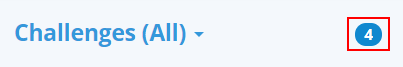
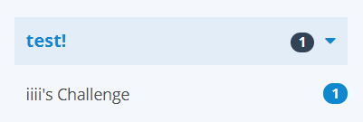
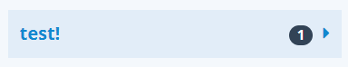
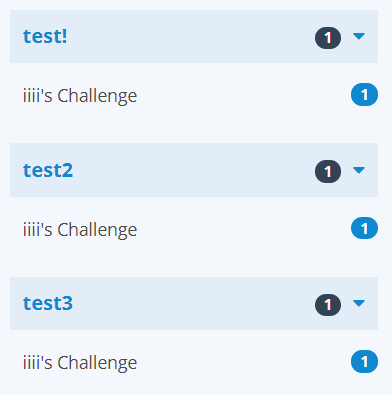
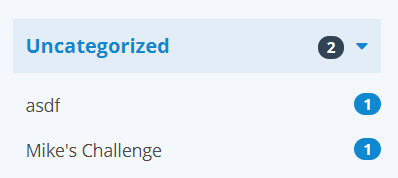
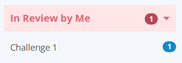

In this section we'll break down how to read each part of the left side panel
in the **Check Solutions** tab.

## Top of the Panel
On the top of the panel is the word **Challenges** with a number on the right
side. The number on the right indicates the total amount of unique solutions
you are currently eligible to check within this community group:

{:.center}

*Note: This number, as well as the rest of the numbers on the page are*
*accurate when the page is first loaded. Any solutions that were submitted*
*after this page was loaded will be reflected the next time you refresh this*
*page*

## Challenge Category Headers
#### Domestic Challenges
Challenge categories that are configured by your community group's admins will
be reflected in this page's organizational structure. Challenges with unchecked
solutions will always be rendered under at least one of these categories like
so:

{:.center}

In this case, the category name is **test!**, and the black number on the right
side of the label is how many solutions remain to be checked for this category.
You may also expand and collapse each category by clicking anywhere on the
label:

{:.center}

#### Foreign Challenges
Foreign challenges (challenges originally created outside your own community
group, but then later shared in) will have any category configured by the
original group's settings, and carry an extra label denoting that it came from
that group. As an example, if your community had a challenge named
**Challenge 3** installed from a community in the **kidOYO ®** group, and it
was part of **A challenge category named Python by kidOYO**, it would look like
this on your dashboard:

{:.center}

*Note: Your group's admins may not configure any foreign installed challenges*
*into a domestic category*

#### Challenges with Multiple Categories
Any challenge that is associated with two or more categories will be rendered
under each category individually as shown here:

{:.center}

In this example, the challenge **iiii's Challenge** appears in categories
**test!**, **test2**, and **test3**. When checking this challenge and the count
gets updated on the page, the labels for every duplicate of
**iiii's Challenge** on the left side panel will simultaneously be updated to
reflect the new count.

#### Challenges With No Categories
Any challenge in your group that has no categories set will appear instead in
a default category with the label **Uncategorized** at the bottom of this list:

{:.center}

#### Challenges In Review
If you have any solutions currently in review by yourself in your community
group, they will appear at the top of the dashboard category list, with a
special color with the title **In Review By Me**. Clicking any challenge in
this special category will immediately load one of the *solutions you*
*currently have in review for this challenge*

{:.center}
