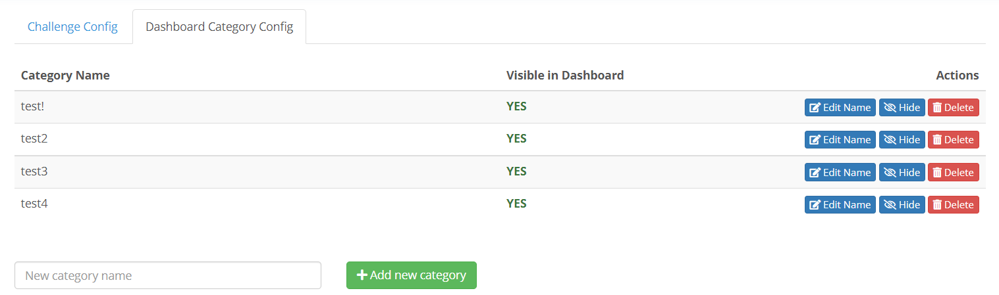

## Overview
This tab allows you to manage your community group's dashboard categories.
**These categories are distinct from each community's challenge categories**.
Keep in mind that these categories are for a global context, so it is not
advised to create different categories for each community as it may make the
challenge solution interface cluttered.

## Actions
When arriving to the page, you will see a list similar to this (or an empty
one if this is the first time anybody in your group is setting up these
categories):

For every category there are three actions you may take:

1. Edit category name
2. Hide/Unhide from dashboard
3. Delete category
    - **WARNING:** This action is irreversible. If you remake the category
    later you will have to manually re-add it to all challenges it was removed
    from

Finally, you may add another category by simply typing a name in the input box
at the bottom of the list and clicking the **Add New Category** button 
