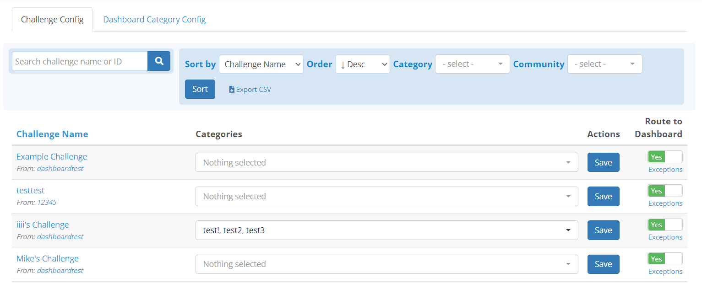
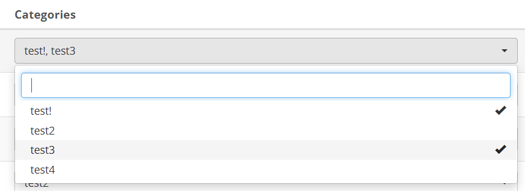
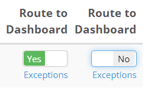
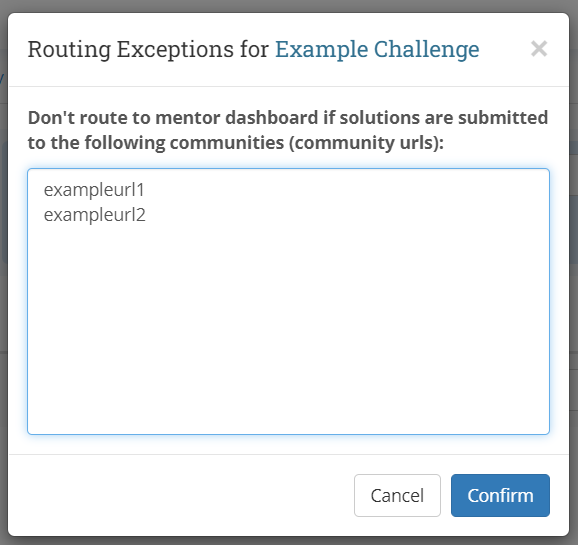
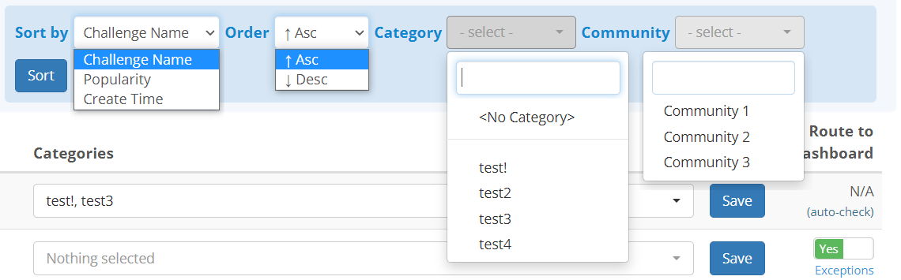
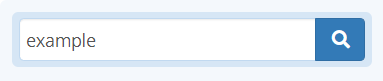
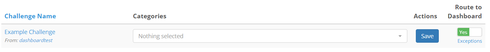

## Overview
The challenge configuration page is one of the tabs available only to community
group admins. Upon accessing the page, you will be brought to a page listing
all challenges created within your community group, with the most recently
created appearing first:

{:.center}

You may click on the **Challenge Name** column header to sort by Alphabetical
Order, and click again to change direction.

*Note: Alphabetical order is case sensitive for this list, A-Z uppercase comes*
*before a-z lowercase*

## Changing a Challenge's Category
You may set a challenge to be as part as many categories as you feel by using
the dropdown next to every challenge in the table:

{:.center}

*Note: You may also type part of the name of your category in the search bar*
*within the dropdown to quickly filter to the categories you want*

You may add additional categories by clicking the **Dashboard Category Config**
tab on the top of the page.

To save your changes to the categories, please click the **Save** button to the
right of the dropdown.

## Routing Options
There are two ways you can customize each challenge's visibility in the
dashboard. One way is to simply turn off the switch labelled **Route to**
**Dashboard:**

{:.center}

You may also choose for any reason to not route submissions from a specific
community by clicking on the **Exceptions** link below the route switch, and
add the **URL prefix** of the community you wish to ignore submissions for,
one URL per line.

This means, if your community's URL was **example.oyoclass.com**, you would
input **example** in the wondow that pops up:

{:.center}

## Sorting and Filtering Challenges
On the top of the table, there are several sort and filter options. You may do
the following with these options:

1. Sort by Challenge Name, Popularity, or Create Time
2. Sort these options in Ascending or Descending order
3. Filter challenges and only show those contained within certain categories,
or specifically for those which do not have a category set
4. Filter challenges by which community they were created in

{:.center}

There is also a quick search bar to the left of the sort and filter options,
which allows you to search by either the name of or the ID of a particular
challenge:

{:.center}

{:.center}
