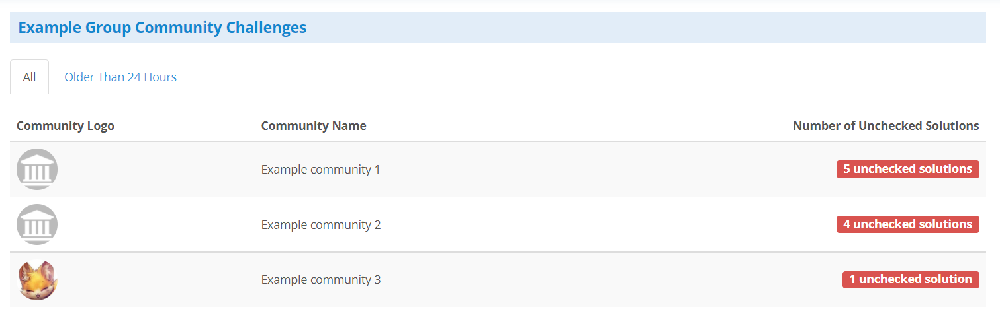
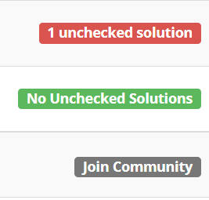

## Overview
In a school community group, this page will list every community that exists
within the community group, and will look similar to this:

{:.center}

This is a simple page designed to help in getting a general idea of which
communities currently have the most unchecked solutions. You may click on any
of the communities listed to immediately jump to that specific community's
challenge admin page.

## Types of Labels
The all tab specifically has three different labels each community can have.
They are:

1. Number of Unchecked Solutions
2. No Solutions to Check
3. Community not Joined
    - If you click on one of these *not joined* communities, the dashboard will
    attempt to bring you to that community's join page, if this community
    allows membership applications

{:.center}
