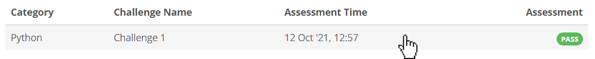
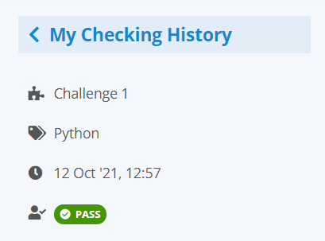
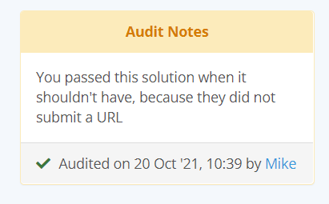
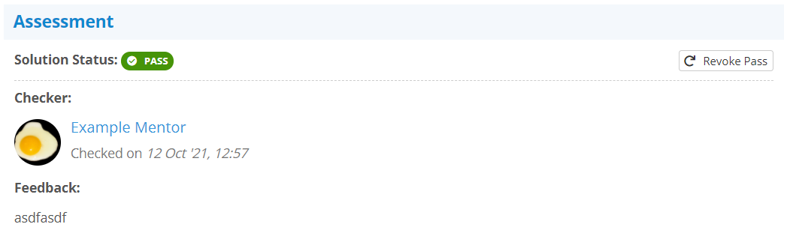
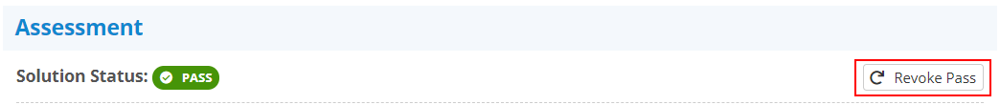
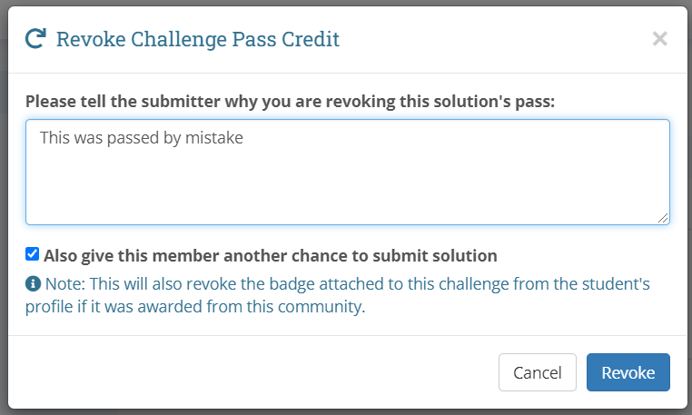
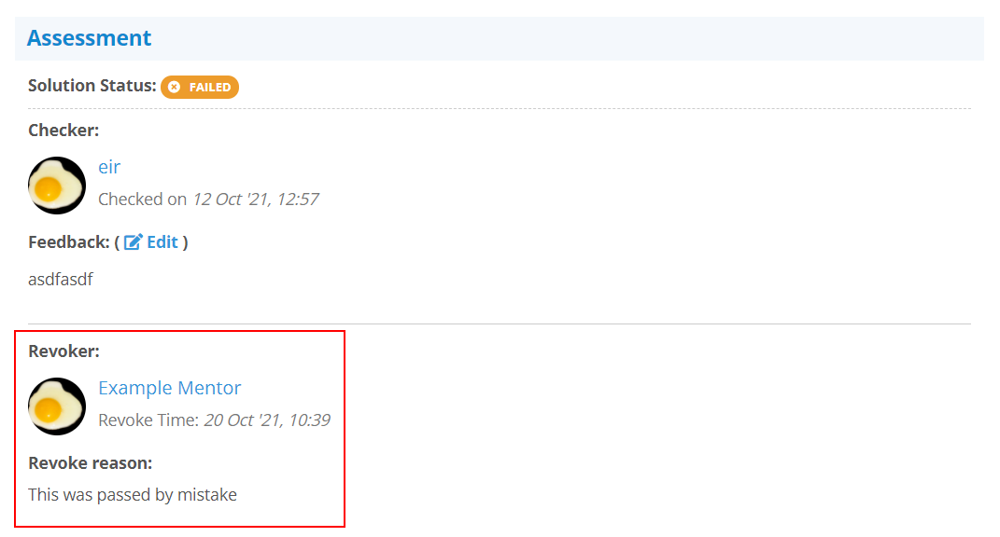

## Accessing a Solution
You may access a particular solution from your history by simply clicking on
it:

{:.center}

## The Left Side Panel
When you are inside a solution, you will have a left side panel that gives some
quick information about the solution you are looking at:

{:.center}

If this solution feedback has been audited by one of your community group's
admins, and they have left a note with the audit, it will also appear in the
left panel below the overview information:

{:.center}

## The History Solution View
Visually, the history solution view looks just like you were checking the
solution:

{:.center}

The key difference is that the  **Check** section is replaced with the
**Assessment** section. Here you can see when you checked the solution, what
your feedback was, and if you passed this solution, revoke it:

{:.center}

## Revoking a Pass
If you ever accidentally pass a solution that should have failed, you may
revoke the pass at any time, provided the student you are revoking the pass
from is still a valid member of the community the solution was submitted in:

{:.center}

This will open a window where you are required to give a reason to the student
why their pass is being revoked. Please note the message at the bottom of this
window: **This will also revoke the badge from the student if the badge was**
**earned in the community you are revoking the pass credit from:**

{:.center}

The student will be sent a notification that their pass has been revoked, and
this information will now appear below the original feedback in the history
view:

{:.center}
