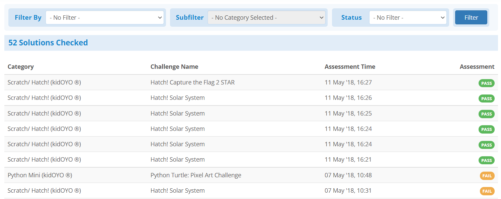
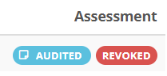

## Overview
After clicking on the **My Checking History** tab, you will be brought to a
page detailing every solution you have checked in your current community group.
In this tab you may review all your checked solutions, any audit notes a super
admin may have left for you, or even revoke the pass from a solution you
realized wasn't correct.

## Types of Labels
The list will show the following for every solution you have checked:

* Category name(s)
* Challenge name
* Date and time the solution was checked
* Whether you have passed or failed the solution

{:.center}

The other labels that may appear in this list are rarer, and appear in the
following cases:

1. If you have passed a solution that was later revoked by either you or
another mentor, the status will appear as **REVOKED**
2. If your solution has been audited by a community group admin, this label
will also appear next to the assessment label as **AUDITED**

{:.center}
