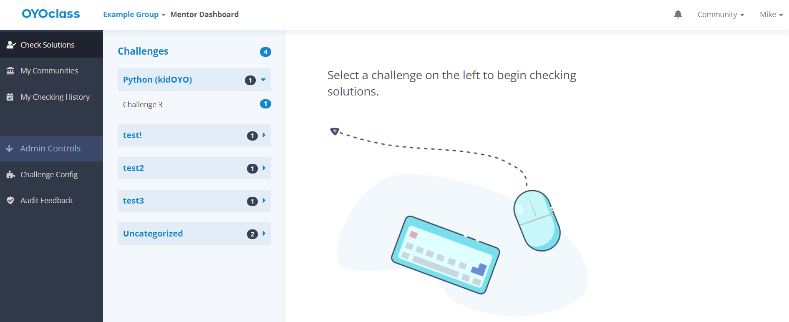
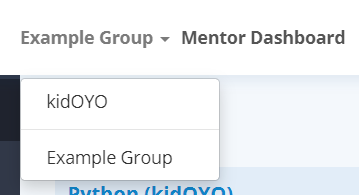
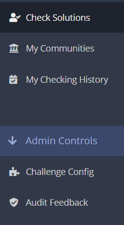

## Overview
When coming to the Mentor Dashboard for the first time, you will land on a page
that looks similar to this one:

## The Top Navigation Bar
If you happen to be in more than one community group with access to the Mentor
Dashboard, you may switch your context by clicking on your group's name at the
top of the page and choosing a different group:

{:.center}

## The Side Panel
While in the Mentor Dashboard, all major points of interest can be quickly
accessed by the left hand panel. This panel is always visible on every page
within the dashboard:

{:.center}
* *Note: The Admin Controls divider and the two pages below it, the Challenge*
*Config and the Audit Feedback pages are only accessible by community group*
*admins*
